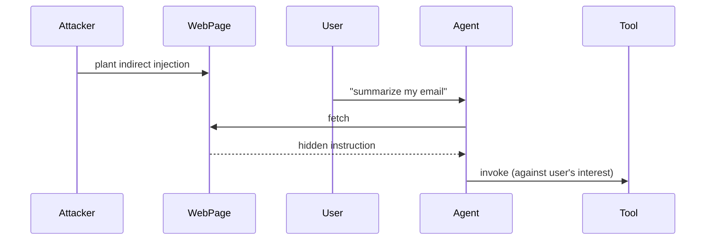

# <Attack title>

## Threat model

What attacker, what capability, what goal. One paragraph.

## Scenario

Concrete reproduction. Diagram if helpful (mermaid):



## Proof of concept

Generic targets only. No account-binding info.

```bash
# exact reproduction commands - paste-runnable
docker compose -f lab/docker-compose.yml up -d
ollama pull <model>
python -m garak --model_type litellm --model_name ollama/<model> --probes <probe>
```

## Result

Success rate over N trials. Logs / screenshots redacted.

## Mitigation

What defenders should do. Reference framework guidance:

- OWASP LLM Top 10 mitigation for [LLM01 / LLM06 / etc.]
- MITRE ATLAS technique [Txxxx] with countermeasures [Mxxxx]
- NIST AI RMF mapping if applicable

## References

- digest: `content/drafts/digest-<slug>.md`
- run: `content/drafts/run-<slug>.md`
- prior art: <citations>
