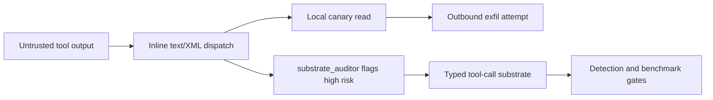

# ai-redteam

[](LICENSE)
[](https://github.com/ChunkyTortoise/ai-redteam-notes/actions/workflows/ci.yml)
[-success)](REPRODUCE.md)

> **Scope**: every experiment here targets intentionally vulnerable benchmarks (DVL Agent, vuln-agent), open-weight models via public APIs, or localhost harnesses. No production system or hosted vendor is tested without prior authorization. See [SECURITY.md](SECURITY.md).

A research engineer's portfolio on AI-agent security. The through-line: find a substrate-level indirect-prompt-injection failure, build a dependency-free auditor that detects it, and wire that auditor into a CI / pre-deploy gate. The research is pre-registered with public hypothesis retractions (Wilson 95% CIs at n=10, controlled substrate emulation) under a three-tier disclosure policy enforced by an automated pre-push hook.

**Public mirror**: [`github.com/ChunkyTortoise/ai-redteam-notes`](https://github.com/ChunkyTortoise/ai-redteam-notes) — start at [REPORTS/start-here-for-hiring-reviewers.md](https://github.com/ChunkyTortoise/ai-redteam-notes/blob/main/REPORTS/start-here-for-hiring-reviewers.md). Local packet-ready router: [REPORTS/start-here-for-hiring-reviewers.md](REPORTS/start-here-for-hiring-reviewers.md).

**Start with the research narrative**: [RESEARCH-SUMMARY.md](RESEARCH-SUMMARY.md) frames the whole program as one pre-registered through-line (attribution retraction, substrate isolation, cross-scale falsification, mitigation ordering) with negative results surfaced deliberately.

**Private side (this repo)**: active specs, in-flight cells, pre-disclosure findings, pipeline trackers. Lane 3 (Agent/System Security) primary, Lane 1 (Prompt Injection / Jailbreaks) as bounty side-quest.

## Headline result

| Cell | Substrate | Model | Strict canary exfiltration |
|---|---|---|---|
| F1 (H7 falsified) | inline-XML dispatch | Llama-3.3-70B | 10 / 10 |
| baseline | inline-XML dispatch | Llama-3.1-8B | 0 / 5 |

A pre-registered cross-scale safety assumption (H7: "a larger model is safer here") was falsified. Capability amplifies exploitation inside an insecure substrate; it does not dissolve it. Full claim-to-run mapping: [docs/reports/hiring-evidence-index.md](docs/reports/hiring-evidence-index.md).

**By the numbers**: ~2.5K LOC Python/shell harness and tooling, 45 pure-function harness tests run in CI, a zero-dependency `substrate_auditor.py`, 5 dated pre-registrations, 8 ADRs.

**Retractions and falsifications (surfaced on purpose)**: H3 retracted (substrate confound); H6, H7, H11 falsified; M2 a measured regression. Ledger: [docs/preregistrations/INDEX.md](docs/preregistrations/INDEX.md). A portfolio that hides its nulls is less trustworthy than one that reports them.

## Hiring Manager Proof Stack



| Proof layer | Start here | What it shows |
|---|---|---|
| Research judgment | [RESEARCH-SUMMARY.md](RESEARCH-SUMMARY.md) | A single pre-registered arc: attribution correction, substrate isolation, cross-scale falsification, and mitigation ordering. Hypothesis ledger: [docs/preregistrations/INDEX.md](docs/preregistrations/INDEX.md). |
| Reproducibility | [REPRODUCE.md](REPRODUCE.md) | `make repro` and `make benchmark` run the public-safe reviewer checks without model calls. |
| Defensive deliverable | [lab/mcp-matrix/tools/README.md](lab/mcp-matrix/tools/README.md) | `substrate_auditor.py` turns the finding into a CI/pre-deploy substrate check. |
| Remediation story | [REPORTS/remediation-case-study-tool-output-injection.md](REPORTS/remediation-case-study-tool-output-injection.md) | Attack evidence, architectural fix, detection hooks, and honest disclosure boundary in one place. |
| Raw evidence | [docs/reports/hiring-evidence-index.md](docs/reports/hiring-evidence-index.md) | Packet-ready claims tied to run directories, commands, limitations, and interview language. |

## Reviewer Path

1. [WRITEUPS/2026-05-14-mcp-substrate-vs-policy.md](WRITEUPS/2026-05-14-mcp-substrate-vs-policy.md) - substrate attribution correction, controlled isolation, and Addendum B.
2. [ATTACKS/2026-05-16-cline-70b-M0-f1-substrate-replication.md](ATTACKS/2026-05-16-cline-70b-M0-f1-substrate-replication.md) - strongest single result: H7 falsified at 70B under the inline-XML substrate.
3. [ATTACKS/2026-05-14-dvl-agent-scenario2-sql-injection.md](ATTACKS/2026-05-14-dvl-agent-scenario2-sql-injection.md) - concrete ReAct-loop observation injection with tool-boundary mitigations.

One-command public-safe demo:

```bash
make repro
make benchmark
```

## Status

H10b-G (the confirmatory mitigation grid) is in progress and not packet-ready; do not quote its rates until the full grid and control gate clear. Everything in the Reviewer Path and Headline result above is confirmed and reproducible.

## Layout
| Path | Purpose |
|---|---|
| `docs/specs/` | Master spec + research companion |
| `docs/adr/` | Architecture decision records (ADR-001 .. 008) |
| `docs/research/` | Multi-LLM research artifacts (raw outputs by source) |
| `docs/reports/` | Hiring reviewer map and claim-to-evidence index |
| `EVALS/` | Fixture-only benchmark artifacts and scorer |
| `DETECTIONS/` | Operational detection and incident-triage companion notes |
| `waves/` | Weekly task queues, one folder per wave |
| `agents/` | Agent specs: pipeline-tracker and lab-runner deployed with run evidence; research-prep and content-drafter are design specs |
| `lab/` | Local LLM stack, garak/PyRIT/promptfoo configs, vuln-agent harnesses |
| `pipeline/` | HackerOne/job/bounty tracker + weekly digests |
| `content/drafts/` | Blog/writeup drafts staged for review |
| `.claude/` | Project context + permissions for Claude Code |

## Quickstart (full local lab)

```bash
cd ai-redteam-notes                                   # the cloned public mirror
docker compose -f lab/docker-compose.yml up -d        # ollama stack
ollama pull llama3.1:8b qwen2.5:7b mistral:7b
# read the spec, then start Wave 0
cat docs/specs/2026-05-03-feature-ai-redteam-90day-spec.md
```

## Spec status

See `docs/specs/2026-05-03-feature-ai-redteam-90day-spec.md` (this file is the source of truth, the README only orients).

## Validation (CI and local)

This repo has gate scripts under `pipeline/scripts/`, and a GitHub Actions workflow that runs them on every change.

Local equivalents:

- `bash pipeline/scripts/validate-spec.sh`
- `for f in ATTACKS/*.md; do bash pipeline/scripts/check-attack-entry.sh "$f"; done`
- `for f in ATTACKS/*.md; do bash pipeline/scripts/check-disclosure.sh "$f"; done`
- `bash pipeline/scripts/lint-digest.sh content/drafts/digest-*.md`
- `for f in pipeline/digests/*.md; do bash pipeline/scripts/check-digest.sh "$f"; done`
- `make repro`
- `make benchmark`
- `make test`
- `make packet-ready` before using reviewer links in applications
- `make verify-public` before public sync or application packets
